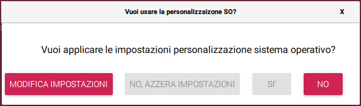
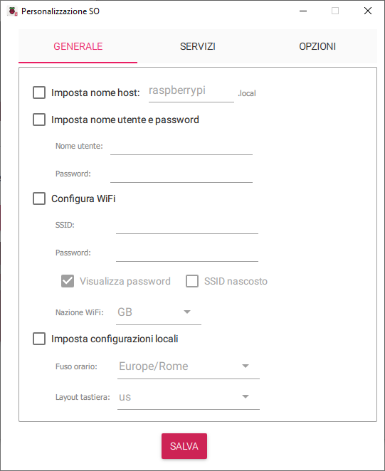
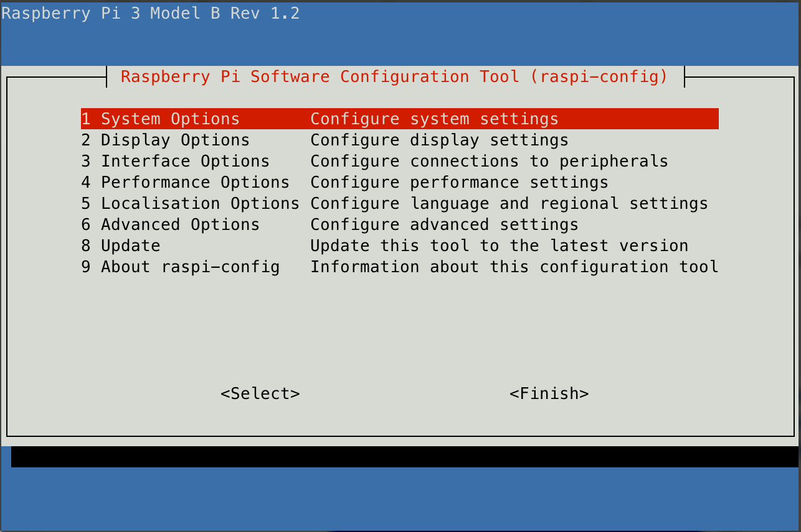

# RASPBERRY PI - Una guida all'uso

## INSTALLAZIONE RASPBERRY PI

[_paragrafo editato il 2024-08-30_]

1. Scaricare _Raspberry Pi Imager_ dal sito ufficiale [Raspberry PI](http://www.raspberrypi.org/downloads)
2. Utilizzando l'applicativo scaricato, selezionare l'immagine del sistema operativo che si vuole installare:
   nel dubbio scegliere "Raspberry PI OS"
   > **NOTA**: in caso si intenda utilizzare in modo HEADLESS (senza monitor e tastiera) e preconfigurare il Wi-Fi,
   > vedere il capitolo dedicato prima di procedere con la creazione dell'immagine.
3. Iserire la SD-CARD sul computer e selezionarla dall'applicativo e avviare la scrittura
4. Inserire l'SD-CARD nel Raspberry PI, accendere ed aspettare fino a completo avvio

A questo punto è possibile collegare un monitor e una tastiera per poter utilizzare il sistema operativo.

### Predisposizione all'uso Headless

Nel caso non si voglia, o non si possa, utilizzare tastiera, mouse e monitor, è possibile effettuare una configurazione
della connessione Wi-Fi seguendo una delle procedure seguenti.

#### Metodo automatico tramite applicazione _Raspberry PI Imager_ (consigliato)

Il nuovo applicativo _Raspberry PI Imager_ ha una funzionalità di personalizzazione.

Prima di procedere alla scrittura della immagine sulla scheda SD
viene presentato il seguente popup



Selezionando la voce `MODIFICA IMPOSTAZIONI` si accede al menù
di configurazione:



Qui è possibile:

- personalizzare l'_hostname_
- creare un utente root personalizzato (sostituisce l'utente _pi_ di default)
- preconfigurare il Wi-Fi, prelevando automaticamente la configurazione dal sistema operativo o
  permettendo si inserirla manualmente
- impostare fuso orario e layout tastiera
Da tab SERVIZI
- abilitare la connessione SSH con login tramite password o chiave pubblica

#### Predisposizione manuale di Wi-Fi e SSH (metodo obsoleto)

Nel caso non si voglia, o non si possa, utilizzare tastiera, mouse e monitor, è possibile effettuare una configurazione
della connessione Wi-Fi seguendo la procedura seguente.

1. inserire la SD-CARD appena configurata nel proprio computer. La formattazione prevede la presenza di una partizione `boot`
   formattata in FAT32 e leggibile e scrivibile anche da computer con sistema operativo Windows o macOS
2. occorre creare un file di configurazione che sarà poi installato nella cartella /etc/wpa_supplicant del SO Raspberry.
   Il file da creare deve chiamarsi `wpa_supplicant.conf` con il seguente contenuto:

    ```sh
    ctrl_interface=DIR=/var/run/wpa_supplicant GROUP=netdev
    update_config=1
    country=IT
     
    network={
        ssid="YOURSSID"
        psk="YOURPASSWORD"
        scan_ssid=1
    }
    ```

    > **NOTA** : sostituire `ssid` e `psk` con le credenziali della propria rete Wi-Fi
    >
    > **ATTENZIONE** : non lasciare spazi attorno al simbolo `=` in questo file, il sistema non lo ammette...

3. copiare il file all'interno della partizione `boot` nell'SD-CARD. Alla prima accensione questo file sarà
   automaticamente spostato nella cartella dedicata ed utilizzato dal sistema operativo.
4. Purtroppo di default il sistema Raspbian non attiva il protocollo SSH, ma esiste un modo veloce per farlo:
   occorre creare un file nominato `SSH` (senza estensione) nella partizione `boot` della SDCARD.

### Headless login

Ovvero **Collegarsi al Raspberry senza utilizzo di Tastiera e Monitor**

E' possibile accedere alla console del sistema Raspberry da remoto senza l'uso della tastiera collegata.

Sarà necessario collegare la Ethernet del Raspberry alla propria rete locale, dotata di DHCP.
Tramite protocollo ssh si potra connettersi al dispositivo.

Seguire i seguenti passi:

1. Scoprire quale indirizzo IP è stato fornito al Raspberry. Per fare questo occorre o utilizzare un qualsiasi
   tool di IP Scanner di rete oppure verificare il dato dal proprio Router.

   > NOTA : di default la scheda si presenta in rete con hostname `raspberrypi` quindi potrebbe non essere necessario
   > cercare l'IP e provare a raggiungere la scheda all'indirizzo `raspberry.local` (da MacOS o Linux)

2. Utilizzando un terminale SSH è ora possibile accedere alla console del Raspberry
    user: `pi` password: `raspberry`

    ```sh
    ssh {indirizzo IP | hostname}
    ```

3. Ora è possibile accedere al menù di configurazione da terminale di Raspbian:

    ```sh
    sudo raspi-config
    ```

---

## PRIME OPERAZIONI POST INSTALLAZIONE

[_paragrafo editato il 2023-05-07_]

   > NOTA: di seguito sono riportate alcune operazioni consigliate da eseguire al
   termine dell'installazione del sistema.
   Si fa riferimento all'articolo : [inDomus: Le prime cose da fare dopo aver installato Raspberry Pi OS (Raspbian)](https://indomus.it/guide/le-prime-cose-da-fare-dopo-aver-installato-raspberry-con-raspbian/)

Tutti i comandi che vengono qui di seguito elencati fanno riferimento al terminale
interno di Raspbian OS, quindi, ad esempio, ad una connessione SSH.

### Primo aggiornamento

La prima cosa da fare è aggiornare tutto il software:

```sh
sudo apt-get update
sudo apt-get upgrade -y
sudo apt autoremove -y
```

al termine conviene effettuare un riavvio:

```sh
sudo reboot
```

### Personalizzazioni

Sempre collegandoci con SSH lanciare il programma di configurazione:

```sh
sudo raspi-config
```

Viene presentata l'interfaccia per la personalizzazione del sistema:



Di seguito viene riportata la lista delle configurazioni consigliate:

#### [System Option]/[Boot / Auto Login]

Selezionare la modalità di avvio del sistema: si consiglia la voce: **`Console`**

#### [Interface Option]/[VNC]

E' fortemente consigliato abilitare i servizi SSH e VNC.
Sicuramente SSH è già abilitato se si è seguita la procedura di installazione proposta.
Il servizio VNC si abilita con la voce di menù qui definita.

#### [Localization Options]

Qui è possibile personalizzare la localizzazione in lingua del prodotto.
Se non fatto durante l'installazione è qui possibile configurare il
layout di tastiera, la Timezone per l'ora e la nazione per le regole di
trasmissione del Wi-Fi.

   > **ATTENZIONE** : è consigliato invece mantenere la lingua del sistema al
   valore di default: `English` in quanto tutte le procedure fanno riferimento
   ai termini inglesi.

#### Riavvio

Al termine della configurazione eseguire il riavvio come proposto dal sistema.

### Configurazione del file di SWAP

Si consiglia di ampliare la dimensione del file di SWAP per evitare eventuali futuri problemi di spazio
insufficiente di memoria (RAM+Swap).

Per farlo, eseguire da terminale il seguente comando per fermare il servizio di swap:

```sh
sudo dphys-swapfile swapoff
```

dopodiché modificare il file di impostazione swap tramite il comando:

```sh
sudo nano /etc/dphys-swapfile
```

andando a modificare la chave “`CONF_SWAPSIZE`” come segue:

```text
CONF_SWAPSIZE=1024
```

dopodiché uscire salvando (`CTRL+X`, `y`, `invio`) e infine riavviare il servizio di swap tramite il comando:

```sh
sudo dphys-swapfile swapon
```

### Keepalive SSH

Per evitare che, in futuro, connessioni SSH possano cadere (“broken pipe”) per inattività, consigliamo la configurazione che segue.
Eseguire il seguente comando:

```sh
sudo nano /etc/ssh/sshd_config
```

posizionarsi in fondo al file e aggiungere:

```text
ClientAliveInterval 300
ClientAliveCountMax 2
```

Uscire e salvare (`CTRL+X`, `y`, `invio`) e poi eseguire il seguente comando:

sudo nano /etc/ssh/ssh_config
e aggiungere in fondo (attenzione ai quattro spazi davanti):

```text
ServerAliveInterval 30
```

Uscire e salvare (`CTRL+X`, `y`, `invio`).
Infine, riavviare con un comando:

```sh
sudo reboot
```

---

## INSTALLAZIONE DI NODE.JS SU RASPBERRY PI ZERO (armv6l)

Purtroppo i build ufficiali delle ultime versioni di Node.js non sono compilati per la piattaforma
hardware ARM v6 utilizzata su Raspberry PI zero.

Per verificare la piattaforma usare il comando:

```sh
uname -m
```

1. scaricare il Node.js compilato per la piattaforma dai [Unofficial builds](https://unofficial-builds.nodejs.org/download/)
del sito ufficiale di Node.js.
Ad esempio il compilato della versione nodejs.14.17.1 per armv6 si trova [qui](https://unofficial-builds.nodejs.org/download/release/v14.17.1/node-v14.17.1-linux-armv6l.tar.xz)

   Quindi scaricare il binario tramite il seguente comando

   ```sh
   wget https://unofficial-builds.nodejs.org/download/release/v14.17.1/node-v14.17.1-linux-armv6l.tar.xz
   ```

2. scompattare l'archivio binario appena scaricato all'interno della cartella nella quale si intende installare Node.js,
ad esempio in `/usr/local/lib/nodejs`

    ```sh
    sudo mkdir -p /usr/local/lib/nodejs
    
    sudo tar -xJvf node-v14.17.1-linux-armv6l.tar.xz -C /usr/local/lib/nodejs
    ```

3. aggiungere il percorso alla variabile d'ambiente PATH. Editale il file `~/.profile` ed aggiungere:

    > _alternativamente è possibile utilizzare il metodo spiegato al punto successivo_

    ```sh
    export PATH=/usr/local/lib/nodejs/node-v14.17.1.linux-armv6l/bin:$PATH
    ```

     riavvia il profilo

    ```sh
    . ~/.profile
    ```

4. creare i link simbolici

    > _metodo alternativo rispetto al punto precedente_

    **NOTA**: alternativamente al questo metodo è possibile creare dei link simbolici agli applicativi node,
    npm e npx direttamente all'interno di /usr/bin. In questo modo tutti gli utenti possono avere accesso a Node.js

    ```sh
    sudo ln -s /usr/local/lib/nodejs/node-v14.17.1-linux-armv6l/bin/node /usr/bin/node

    sudo ln -s /usr/local/lib/nodejs/node-v14.17.1-linux-armv6l/bin/npm /usr/bin/npm
    
    sudo ln -s /usr/local/lib/nodejs/node-v14.17.1-linux-armv6l/bin/npx /usr/bin/npx
    ```

5. test del corretto funzionamento di node, npm  e npx

    ```sh
    node -v
    
    npm version
    
    npx -v
    ```

---

## INSTALLARE DOCKER SU RASPBERRY PI OS

[_paragrafo editato il 2023-05-07_]

Di seguito si fa uso della procedura automatica di installazione.

### Aggiornamento del sistema

Per prima cosa, occorre effettuare un aggiornamento del sistema:

```sh
sudo apt-get update -y
sudo apt-get upgrade -y
sudo reboot
```

### Installazione automatica

Successivamente al riavvio causato dall’ultimo comando, installare tramite procedura automatica l’ambiente
di virtualizzazione Docker tramite il comando:

```sh
sudo curl -fsSL https://get.docker.com -o /tmp/get-docker.sh
sudo chmod +x /tmp/get-docker.sh
sudo sh /tmp/get-docker.sh
```

### Aggiunta dell'utente al gruppo `docker`

Questo autorizza l'utente ad eseguire direttamente i comandi `docker`

```sh
sudo usermod -aG docker $USER
sudo reboot
```

### Verifica

Successivamente all’avvenuta installazione e per verificare che Docker sia **correttamente installato**, eseguire il seguente comando:

```sh
docker run hello-world
```

Per confermare la bontà dell’installazione ed esecuzione di Docker, l’output dev’essere simile al seguente:

```txt
Unable to find image 'hello-world:latest' locally
latest: Pulling from library/hello-world
70f5ac315c5a: Pull complete
Digest: sha256:9eabfcf6034695c4f6208296be9090b0a3487e20fb6a5cb056525242621cf73d
Status: Downloaded newer image for hello-world:latest

Hello from Docker!
This message shows that your installation appears to be working correctly.

To generate this message, Docker took the following steps:
 1. The Docker client contacted the Docker daemon.
 2. The Docker daemon pulled the "hello-world" image from the Docker Hub.
    (arm64v8)
 3. The Docker daemon created a new container from that image which runs the
    executable that produces the output you are currently reading.
 4. The Docker daemon streamed that output to the Docker client, which sent it
    to your terminal.

To try something more ambitious, you can run an Ubuntu container with:
 $ docker run -it ubuntu bash

Share images, automate workflows, and more with a free Docker ID:
 https://hub.docker.com/

For more examples and ideas, visit:
 https://docs.docker.com/get-started/
```

---
Per ora è tutto

alv67
