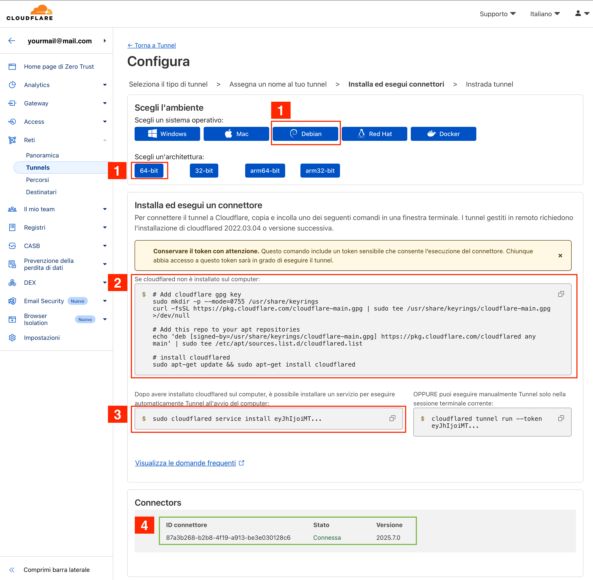
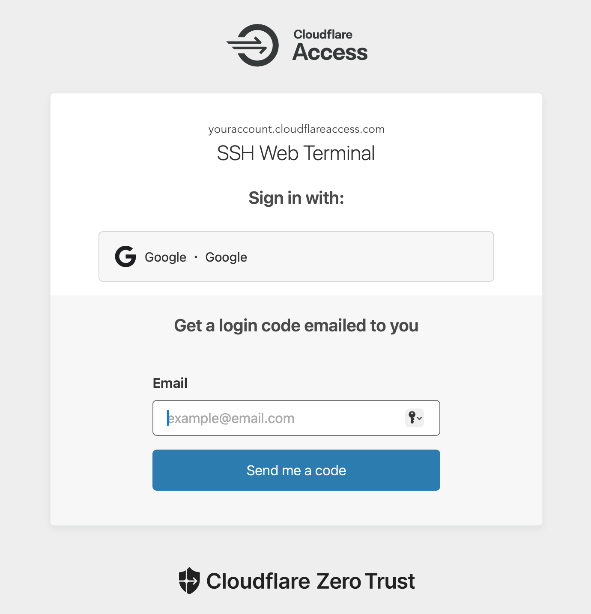
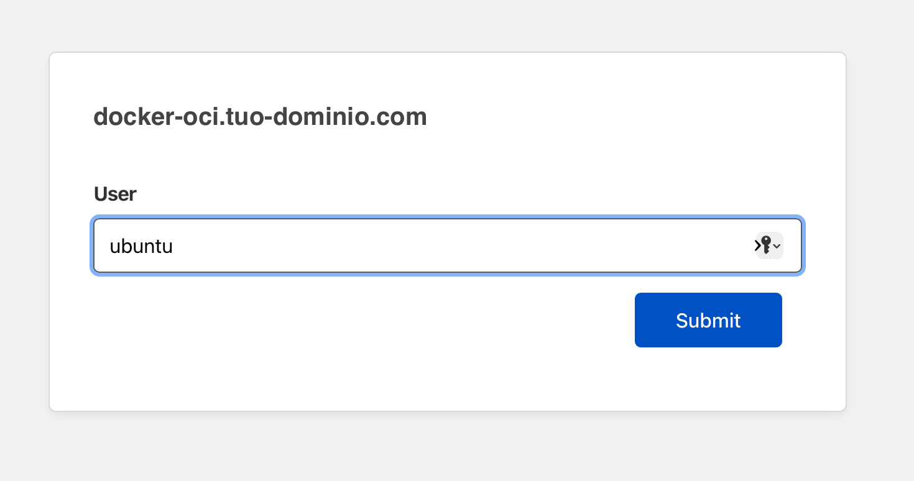
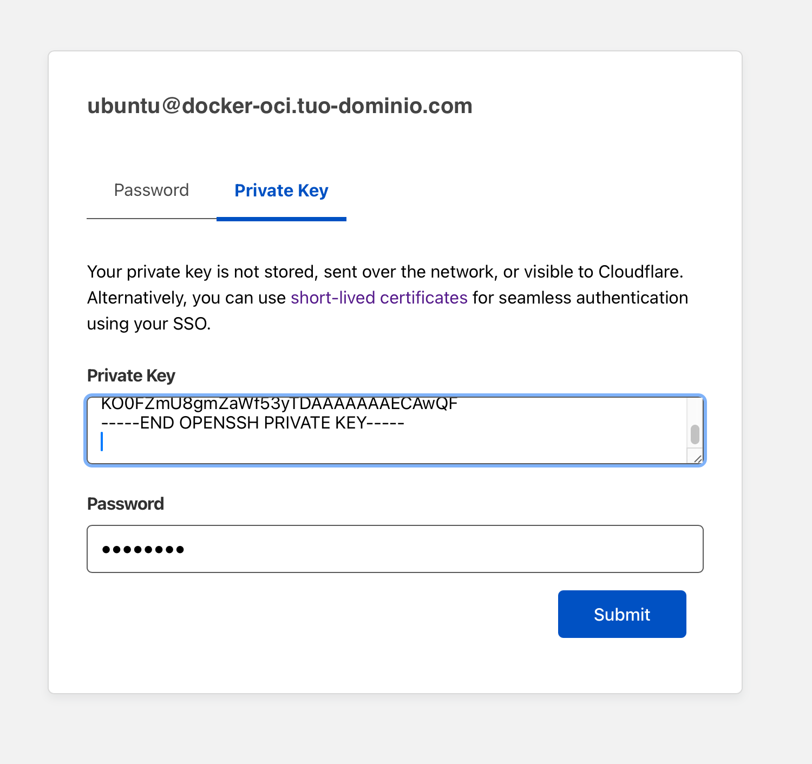
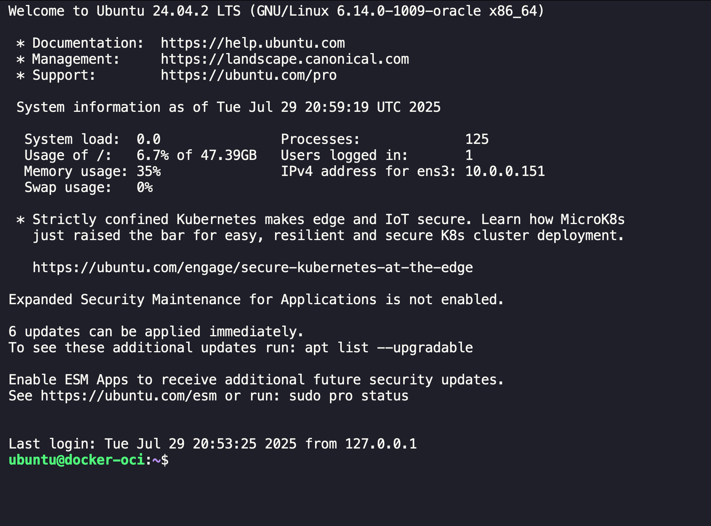

# Pubblicare l'accesso SSH tramite Cloudflare Tunnel (con autenticazione Cloudflare)

Per accedere in modo sicuro al terminale SSH della tua istanza tramite un'interfaccia web, puoi utilizzare **Cloudflare Tunnel**
e la funzionalità **SSH Web Terminal** di Cloudflare Access.  
Questo permette di esporre la porta SSH tramite un URL protetto, ad esempio `docker-oci.tuo-dominio.com`, e
accessibile solo previa autenticazione Cloudflare.

> In questa guida si fa riferimento a un'istanza Ubuntu su Oracle Cloud Infrastructure (OCI) free tier,
ma il processo è simile per altre piattaforme cloud.

## Prerequisiti

- Un dominio gestito su Cloudflare (es: `tuo-dominio.com`)
- Accesso all'account Cloudflare e permessi per creare un tunnel e configurare Access
- Cloudflare Tunnel installato sulla VM

## Installare Cloudflare Tunnel (cloudflared)

Dal sito Cloudflare andare alla sezione "Zero-Trust" / "Tunnels"

Poi selezionare la voce "Create Tunnel" e seguire le istruzioni.



### 1. Scegli l'ambiente

Selezionare il sistema operativo in uso `Debian`e l'architettura `64-bit`

### 2. Installare cloudflared

Per installare `cloudflared` su Ubuntu, copiare il codice proposto sul sito:

```shell
# Add cloudflare gpg key
sudo mkdir -p --mode=0755 /usr/share/keyrings
curl -fsSL https://pkg.cloudflare.com/cloudflare-main.gpg | sudo tee /usr/share/keyrings/cloudflare-main.gpg >/dev/null

# Add this repo to your apt repositories
echo 'deb [signed-by=/usr/share/keyrings/cloudflare-main.gpg] https://pkg.cloudflare.com/cloudflared any main' | sudo tee /etc/apt/sources.list.d/cloudflared.list

# install cloudflared
sudo apt-get update && sudo apt-get install cloudflared
```

### 3. Attivare il servizio cloudflared

Come indicato sulla pagina copiare il comando ed eseguirlo. Attenzione il comando contiene un UUID che è unico
per ogni tunnel che non viene mostrato completamente a video, ma passato solo
copiando il comando.

Il comando sarà simile al seguente:

```shell
sudo cloudflared service install ytrbgDFwsAQWcdfFSDGfdgfd.....
```

### 4. Verifica attivazione servizio

Non appena il servizio sarà attivo sulla pagina compare lo stato di connessione.

### 5. Instrada il traffico

Premere il pulsante _Successivo_ a fondo pagina per procedere alla configurazione del tunnel.

Qui si configura il tunnel per instradare il traffico verso la porta SSH della tua istanza.

- Nome host
  - Sottodominio : `docker-oci`
  - Dominio : `tuo-dominio.com`
  - Percorso : lasciare vuoto
- Servizio
  - Tipo: `SSH`
  - URL: `localhost:22`

### 6. Configura Cloudflare Access per SSH Web Terminal

1. Vai su _Zero Trust_ → _Access_ → _Applicazioni_ → `+ Aggiungi un'applicazione`.
2. Scegli **Self-hosted**.
3. Nome Applicazione : `SSH Web Terminal`, Durata sessione: `24 hours`
4. _Aggiungi nome host pubblico_ : Sottodominio: `docker-oci`, Dominio: `tuo-dominio.com`
5. _Impostazioni di rendering del browser_ : scegli **SSH**
6. Configura le policy di accesso (ad esempio, solo il tuo account email Cloudflare).
7. Salva e attiva l'applicazione.

Ora, accedendo a `https://docker-oci.tuo-dominio.com` da browser, Cloudflare ti chiederà di autenticarti e ti presenterà
l’interfaccia web del terminale SSH collegato alla tua istanza.

### 7. Crea una chiave SSH per l'accesso web

Cloudflare richiede una chiave **SSH protetta da password** per autenticare l'accesso al terminale web.
Puoi generare una chiave SSH con il seguente comando su di un terminale del tuo computer locale:

```shell
ssh-keygen -t ed25519 -f ~/.ssh/cloudflare_ssh_key -C "cloudflare-ssh" -N "your_password"
```

### 8. Aggiungi la chiave pubblica all'istanza

Ora copia la chiave pubblica generata (nel computer locale `~/.ssh/cloudflare_ssh_key.pub`) e aggiungila
alla tua istanza come chiave autorizzata per l'utente `ubuntu` nel file `~/.ssh/authorized_keys`.

E' possibile farlo direttamente dal tuo terminale locale con il comando:

```shell
ssh-copy-id -i ~/.ssh/cloudflare_ssh_key.pub ubuntu@[public.ip.address]
```

In alternativa, puoi copiare manualmente il contenuto della chiave pubblica
nel file `~/.ssh/authorized_keys` dell'utente `ubuntu` sulla tua istanza.

Al termine assicurati che il file `authorized_keys` abbia i permessi corretti:

```shell
chmod 600 ~/.ssh/authorized_keys
```

Per accedere al terminale web, dovrai utilizzare la chiave privata generata (`~/.ssh/cloudflare_ssh_key`) e ricordarti la
password utilizzata in fase di creazione.

### 9. Accedi al terminale web

Ora puoi accedere al terminale web SSH visitando `https://docker-oci.tuo-dominio.com` nel tuo browser.

Se non già effettuato a cloudflare, ti verrà chiesto di autenticarti con il tuo account Cloudflare.



Una volta effettuato l'accesso verrai reindirizzato al terminale web SSH.
La prima richiesta è l'utente da utilizzare per l'accesso SSH, inserire `ubuntu` e premere _Next_.



Di seguito ti verrà chiesto di inserire la chiave SSH privata e la password associata.
Copia il contenuto della chiave privata generata (`~/.ssh/cloudflare_ssh_key`) e incollalo nel campo _Private Key_.
Poi inserisci la password che hai scelto durante la generazione della chiave.



Se tutto è andato a buon fine, dovresti vedere il terminale SSH della tua istanza.



Questa procedura ti permette di accedere in modo sicuro e protetto al terminale della tua istanza tramite browser,
senza esporre direttamente la porta SSH su internet.
