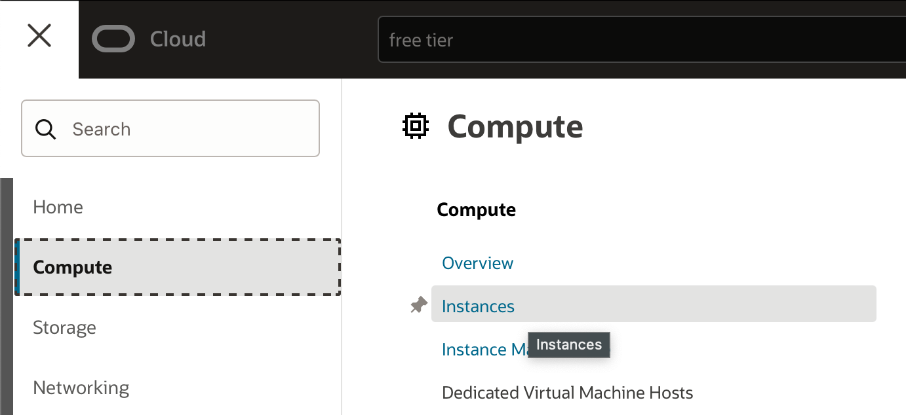
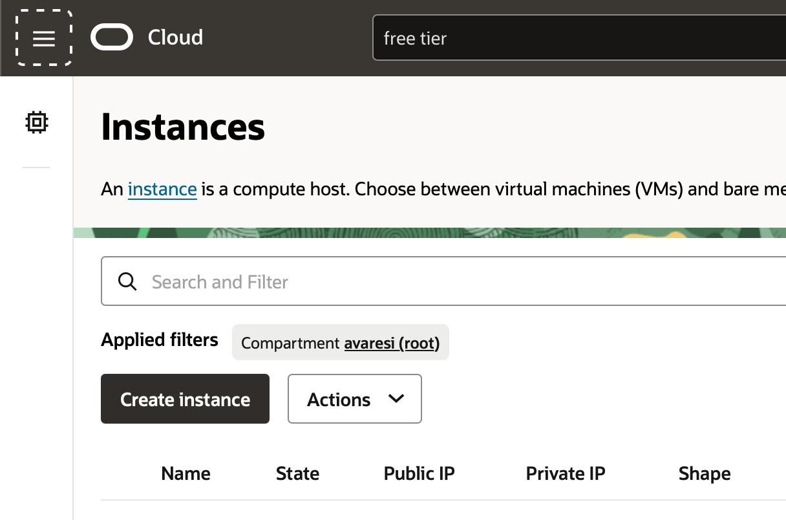
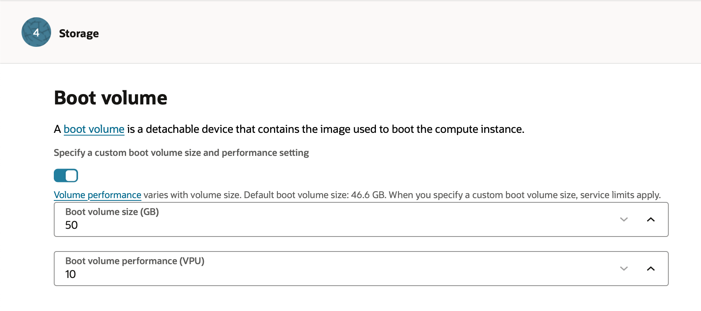
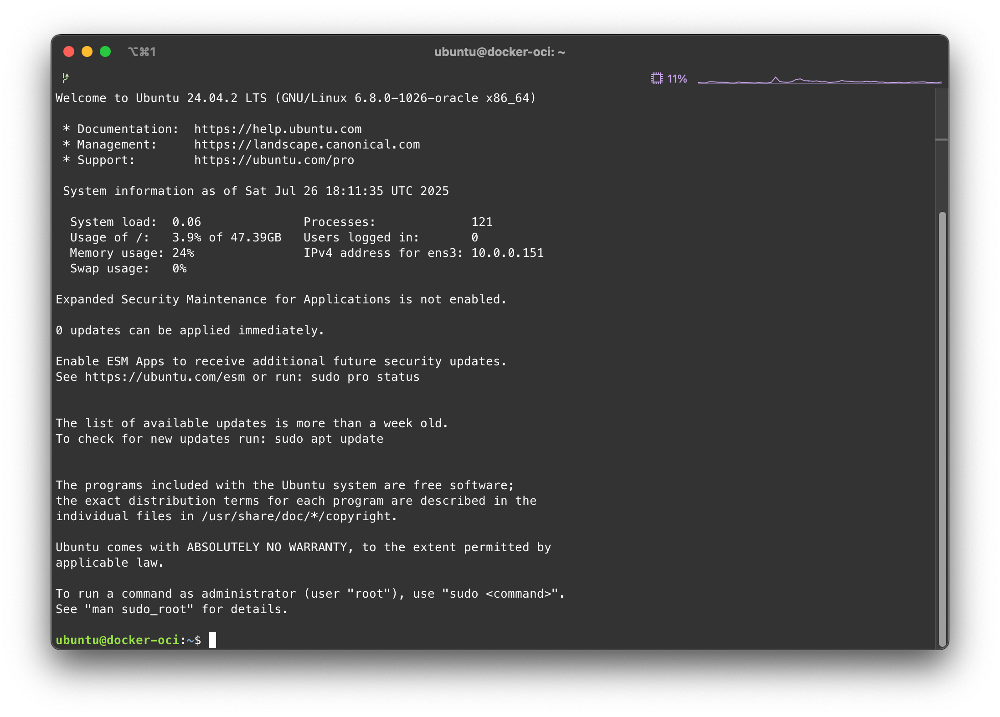

# Predisponi server Docker su Oracle OCI (free tier)

[_documento editato il 2025-07-26_]

Oracle nella piattaforma _Oracle Cloud Infrastructure_ (OCI) mette a dispisizione un ottimo _tier gratuito_
In questo _tier_ sono disponibili risorse per creare instanze di macchine virtuali nel piano che viene indicato come _always-free_.

In particolare si hanno a disposizione:

- due instanze AMD x86_64 con 1/8 OCPU (corrispondenti a 2 vCPU) e 1GB di RAM.
- una istanza ARM-based 4 core e 24 GB di RAM

Inoltre si hanno a disposizione 200GB di blocco dati da utilizzare come memoria di massa.
Siccome il minimo utilizzabile per ogni istanza è pari a 49GB, alla fine si consiglia di utilizzare:

- 100GB per la istanza ARM-Based
- 50GB per ogni istanza AMD

## Ubuntu su istanza VM.Standard.A1.Flex

Di seguito si riportano i passi necessari per la creazione dell'istanza gratuita.

### Selezionare creazione di Compute-Instance

Dal menù principale di OCI selezionare la voce Compute->Instances



E dalla pagina che si presenta selezionare il pulsante _Create Instance_



### 1. Creazione dell'istanza: Basic informations

Compilare il form con le informazioni richieste:

- **Name**: Nome dell'istanza, ad esempio `docker-oci`
- **Compartment**: Il compartment in cui si vuole creare l'istanza.
  Se è la prima volta ci sarà un solo compartment chiamato (_root_).

Selezionare il sistema operativo: premere il pulsante _Change image_ e
selezionare la voce `Canonical Ubuntu 24.04`; premere _Select image_.

Selezionare il tipo di istanza: quella proposta di default
dovrebbe già essere corretta, in ogni caso selezionare `VM.Standard.E2.1.Micro`.

Premere _Next_ per proseguire.

### 2. Security

Lasciare le opzioni di default e premere _Next_.

### 3. Networking

Se è già stato creato un Virtual Cloud Network (VCN) si può selezionare quello esistente, altrimenti si può creare un nuovo VCN.

Scegliere un nome per il VCN, ad esempio `docker-oci-vcn`.

Se si crea un nuovo VCN spuntare _Create a new virtual cloud network_ e lasciare le opzioni di default.

Spuntare la voce _Create a new public subnet_ e lasciare le opzioni di default.

Sarebbe opportuno selezionare la voce _Assign a public IPv4 address_ per poter accedere all'istanza da internet,
ma se la subnet viene create con questa opzione, la voce pare non selezionabile

!! MOLTO IMPORTANTE !!

Occorre aggiungere una chiave SSH per poter accedere all'istanza una volta creata.
Selezionare la voce _Add SSH keys_ e incollare la chiave pubblica SSH generata in precedenza,
o se non si ha c'è la possibilità di generarla direttamente da questa pagina.

> **NOTA**
>
> senza una chiave SSH non sarà possibile accedere all'istanza una volta creata.

### 4. Storage

Occorre ora creare il disco di boot per l'istanza.

Spuntare la voce _Specify a custom boot volume size and performance settings_

Scegliere la dimensione del disco di boot, ad esempio 50GB.



> NOTA.
>
> 50GB è il minimo richiesto per le istanze AMD.
> Nel piano free tier si hanno a disposizione un massimo di
> 200GB suddivisi tra le istanze.

Lasciare le altre opzioni di default e premere _Next_.

### 5. Review and create

Vengono ora presentate le informazioni inserite, se tutto è corretto premere il pulsante _Create_.

Come si può notare alla sezione _Networking_ viene indicato che la subnet è pubblica,
e l'opzione _Public IPv4 address_ è impostata a _Yes_.

### Attendere la creazione dell'istanza

Ora parte automaticamente la creazione dell'istanza, che può richiedere qualche minuto.

Al termine, selezionare dal menù _Instances_ l'istanza appena creata e dal tab _Details_
si può vedere l'indirizzo IP pubblico assegnato all'istanza e lo username.

Possiamo ora provare a connetterci tramite SSH alla'istanza utilizzando l'indirizzo IP pubblico
e lo username `ubuntu` e la chiave SSH precedentemente inserita.

```shell
ssh -i [path/to/your/private/key] ubuntu@[public.ip.address]
```

Se tutto è andato a buon fine si dovrebbe essere connessi all'istanza.



Ora occorre assicurarsi di avere settato il firewall per permettere al traffico internet di raggiungere l'istanza.

Connettersi all'istanza tramite connessioe SSH ed scaricare l'immagine necessaria per installare il da rete Proxmox:

```shell
sudo -i
cd /boot/efi
wget https://boot.netboot.xyz/ipxe/netboot.xyz-arm64.efi
```

## Configurare Ubuntu

Ora che l'istanza è pronta, possiamo procedere con la configurazione di Ubuntu per l'utilizzo di Docker.

### Aggiornare il sistema

La prima cosa da fare è aggiornare il sistema operativo all'ultima versione disponibile.

```shell
sudo apt update && sudo apt upgrade -y
```

Al termine dell'aggiornamento, è consigliabile riavviare l'istanza per assicurarsi che tutte le modifiche abbiano effetto.

```shell
sudo reboot
```

### Installare Docker

Per installare Docker su Ubuntu, occorre predisporre il sistema con i certificati e il repository ufficiale di Docker.

```shell
# Add Docker's official GPG key:
sudo apt-get update
sudo apt-get install ca-certificates curl
sudo install -m 0755 -d /etc/apt/keyrings
sudo curl -fsSL https://download.docker.com/linux/ubuntu/gpg -o /etc/apt/keyrings/docker.asc
sudo chmod a+r /etc/apt/keyrings/docker.asc

# Add the repository to Apt sources:
echo \
  "deb [arch=$(dpkg --print-architecture) signed-by=/etc/apt/keyrings/docker.asc] https://download.docker.com/linux/ubuntu \
  $(. /etc/os-release && echo "${UBUNTU_CODENAME:-$VERSION_CODENAME}") stable" | \
  sudo tee /etc/apt/sources.list.d/docker.list > /dev/null
sudo apt-get update
```

A questo punto è possibile effettuare l'installazione:

```shell
sudo apt-get install docker-ce docker-ce-cli containerd.io docker-buildx-plugin docker-compose-plugin
```

#### Abilitare utente corrente per l'utilizzo di Docker

Per poter utilizzare Docker senza dover utilizzare il comando `sudo`, è necessario aggiungere l'utente corrente al gruppo `docker`.

```shell
sudo usermod -aG docker $USER
```

Dopo aver eseguito questo comando, è necessario disconnettersi e riconnettersi per applicare le modifiche.  
Per verificare che tutto funzioni correttamente, è possibile eseguire il comando:

```shell
docker run hello-world
```

Se tutto è andato a buon fine, si dovrebbe vedere un messaggio di benvenuto da parte di Docker.

### Ripulire il sistema

Iniziamo ripulendo docker:

```shell
docker system prune -a --volumes
```

Proseguiamo ora con la pulizia del sistema:

```shell
sudo apt autoremove --purge -y
sudo apt clean
sudo rm -rf /var/lib/apt/lists/*
```
