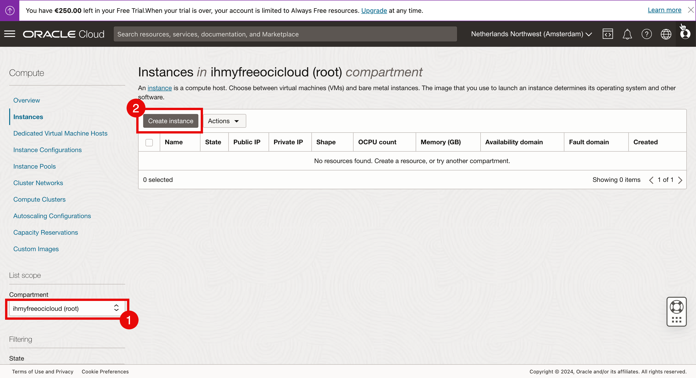

# Oracle Cloud Interface Free Tier

[_documento editato il 2025-05-06_]

Il **Free Tier di Oracle Cloud Infrastructure (OCI)** è un’offerta che consente agli utenti di
utilizzare alcuni servizi cloud di Oracle gratuitamente, senza limiti di tempo su alcune
risorse (denominate _Always Free_) e con accesso temporaneo ad altri servizi più avanzati (detti _Free Trial_ o _Trial Credit_).

Ovviamente qui ci limitiamo ad utilizzare alcuni dei servizi definiti _Always Free_.

I servizi _Always Free_ sono:

- **☁️ Compute**
  - 2 istanze AMD o Intel (VM.Standard.E2.1.Micro) con:
    - 1 vCPU e 1 GB RAM ciascuna
    - Ideale per piccole applicazioni web, bot, test ecc.
  - 4 OCPU + 24 GB RAM su Arm-based instances (Ampere A1)[^1]
    - Puoi usarli come una sola VM o fino a 4 VM più piccole.
    - Prestazioni molto buone per il free tier.

- **💾 Block Volume (Storage)**
  - 2 volumi fino a 200 GB totali.
  - Può essere usato come disco di sistema o aggiuntivo alle istanze compute.

- **📦 Object Storage**
  - 10 GB di standard storage
  - 10.000 richieste PUT e 1.000.000 richieste GET al mese
  - Perfetto per salvare file, backup, log, etc.

- **🛢️ Autonomous Database (ATP/ADW)**
  - 2 database (ATP = Autonomous Transaction Processing, ADW = Autonomous Data Warehouse)
  - Ognuno con:
    - 1 OCPU
    - 20 GB di storage
    - Console SQL Web inclusa

- **🌐 Networking**
  - 10 TB al mese di traffico in uscita (verso internet)
  - IP pubblico statico gratuito per le istanze compute
  - VCN, subnet, firewall, route table, DNS

- **📡 Load Balancer**
  - 1 load balancer gratuito:
  - 10 Mbps di bandwidth

- **📊 Monitoring & Logging**
  - Metriche e log base inclusi (con limiti), utili per il monitoraggio delle risorse.

> ⚠️ Limitazioni importanti
>
> - Le risorse Always Free hanno limiti rigidi (es. 1 GB RAM, 10 GB Object Storage, ecc.)
> - Le risorse gratuite vengono disattivate se non usate per troppo tempo.
> - Per l’attivazione serve una carta di credito, ma Oracle non addebita nulla senza consenso.
>

Nonostante queste limitazioni, _OCI Free Tier_ è utilizzabile senza la preoccupazione di costi
nascosti in quanto risulta possibile attivare soltanto le funzionalità gratuite, mentre per
utilizzare funzionalità a costo occorre esplicitamente cambiare il proprio account ad un
abbonamento a pagamento.

Ecco alcuni esempi di utilizzo del _Free Tier_:

- Ospitare un sito o un’app web su una VM Ampere
- Creare un piccolo database autonomo per sviluppo
- Salvare file e backup su Object Storage
- Usare un load balancer per una demo o test
- Avviare container Docker su VM gratuite

## Creiamo una istanza Ampere A1 (Arm-based) 4 OCPU e 24GB

I prerequisiti sono:

- Aver creato un account su [https://oracle.com/cloud/free](https://oracle.com/cloud/free)
- Aver completato la verifica della carta ed essere nel periodo di trial o nella modalità _Always Free_
- Aver accettato il contratto per le istanze Arm (lo chiede al primo avvio)

Quando creiamo un account OCI di prova gratuito, per impostazione predefinita verranno creati
un tenant, un compartimento radice, una rete cloud virtuale (VCN) e un gateway internet.

### 1. Creare una nuova instanza di calcolo

Eleguire il login a OCI Console
Selezionare dal menù _hamburger_ [≡] selezionare `Compute` → `Instances`

Nella pagina **Instances**

1. selezionare il _Compartment_ `(root)`
2. Fare click su `Create instance`

### 2. Configurare i parametri dell'istanza

Nella pagina **Create compute instance** compilare i campi come segue.

- **Name** : scegli un nome (es. ampere-server)
- **Create in compartment**: lasciare quello di default (root)

Scegli **Image e Shape** selezionando l'apposita `Edit`

`Change image` permette di scegliere l'immagine del sistema operativo tra quelli proposti
_Always Free-eligible_ (Oracle Linux, Ubuntu, CentOS).

Per esempio utilizziamo quello proposto di default: Oracle Linux 8

`Change shape` permette di scegliere tra alcune architetture _Always Free-eligible_ :

- VM.Standard.E2.1.Micro : AMD 2.0 GHz, 1 GB RAM
- VM.Standard.A1.Flex: Ampere (ARM) 3.0 GHZ : fino a 24 GB RAM

Scegliamo Ampere, 4 OCPU e 24 GB RAM

Occorre aggiungere una chiave SSH per la connessione remota alla macchina,
nella sezione **Add SSH keys** è possibile caricare una propria chiave pubblica oppure permette di creare una nuova dedicata.

Nella sezione **Boot volume** selezionare
`Specify a custom boot volume size` e nel campo che compare scegliere
la dimensione. Il minimo è 49GB, ma avendo a disposizione fino a 200GB si sceglie di dedicarne **100GB** per questa VM.
Lasciare il parametro VPU con il valore di default.

Terminare la creazione della VM premendo sul comando `Create` a fondo pagina.

[^1] Oracle ha cominciato a ridurre drasticamente le possibilità di installare gratuitamente
     l'istanza Ampere 1 (Arm Based). Questo dipende molto dalla regione scelta in fase di
     registrazione: ad esempio in _Switzerland North (Zurich)_ non sono più disponibili
     istanze gratuite.
