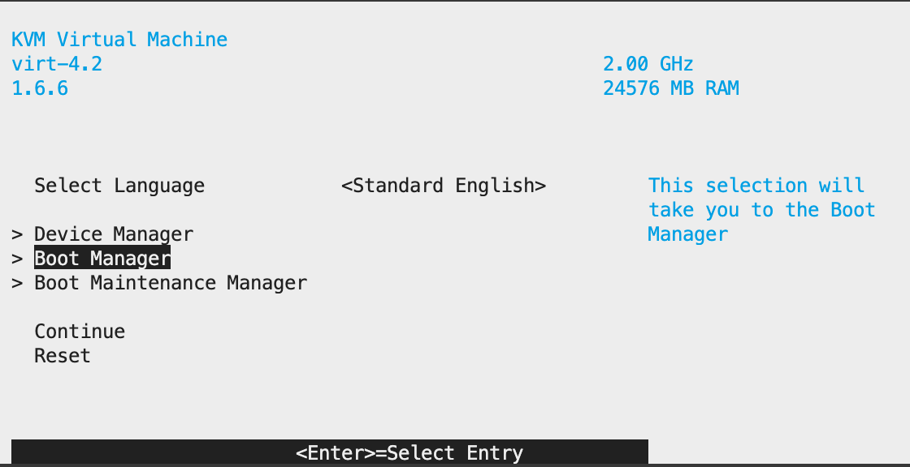
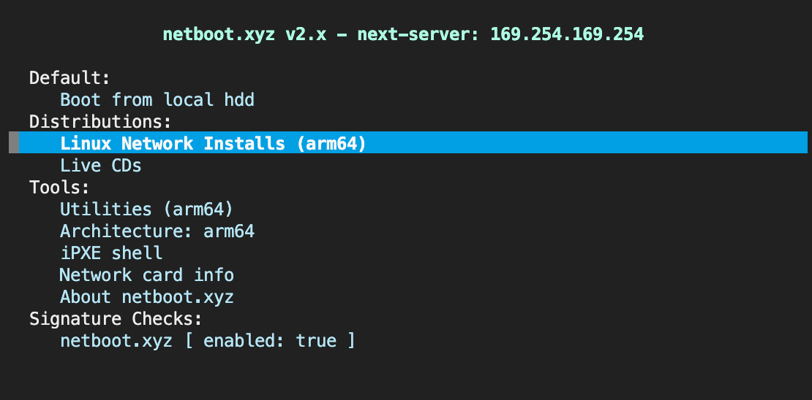
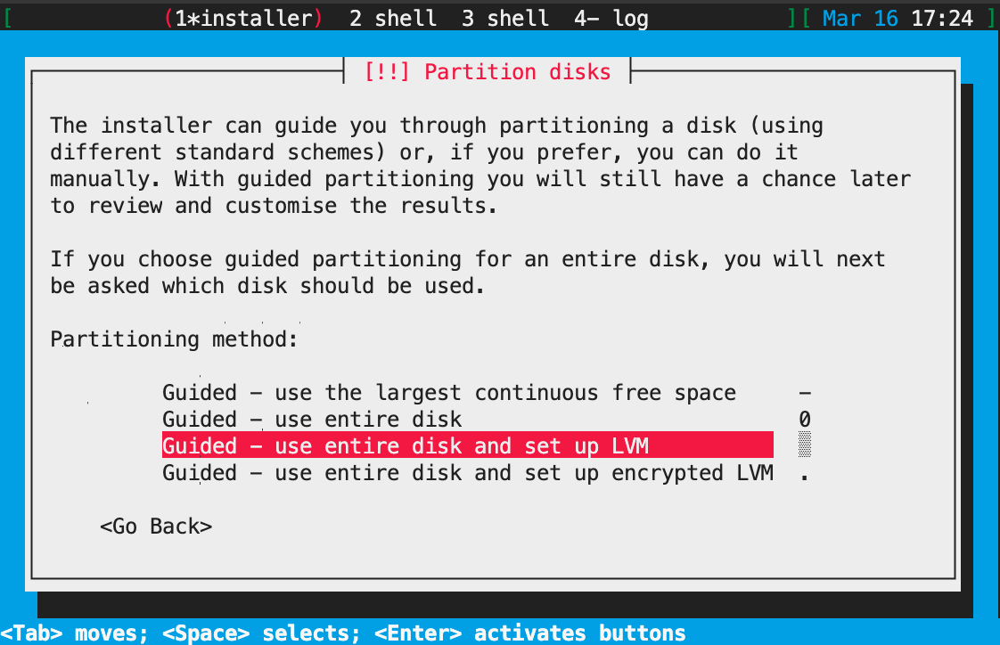
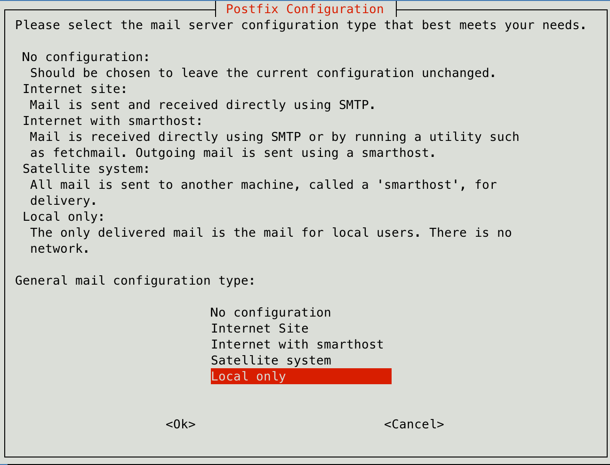
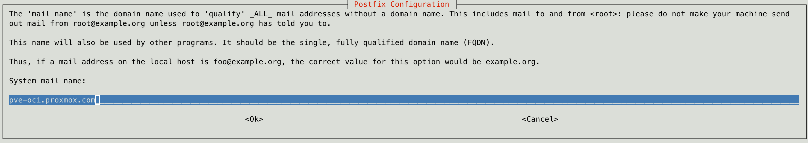
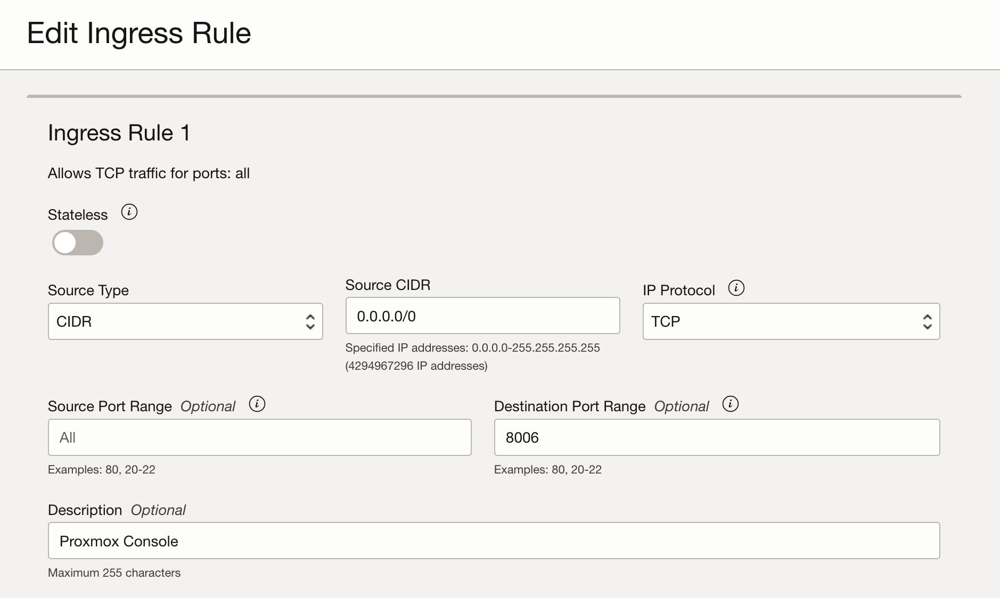
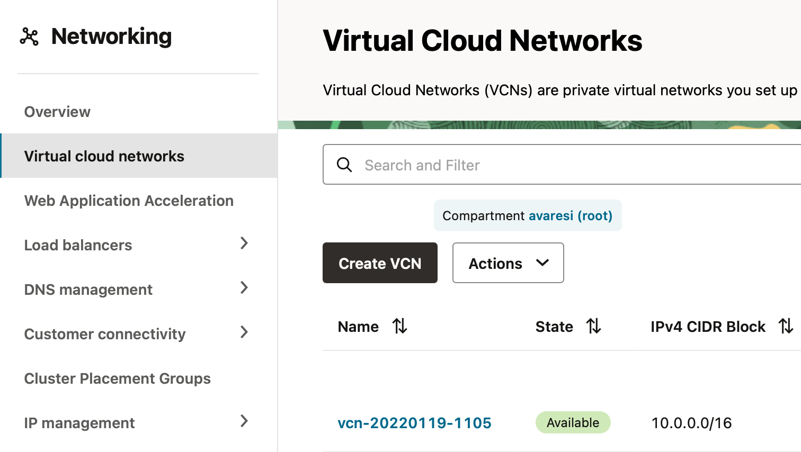
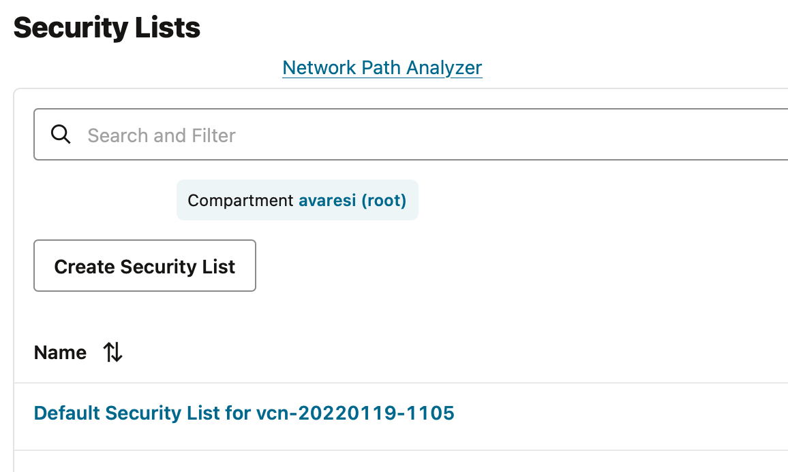
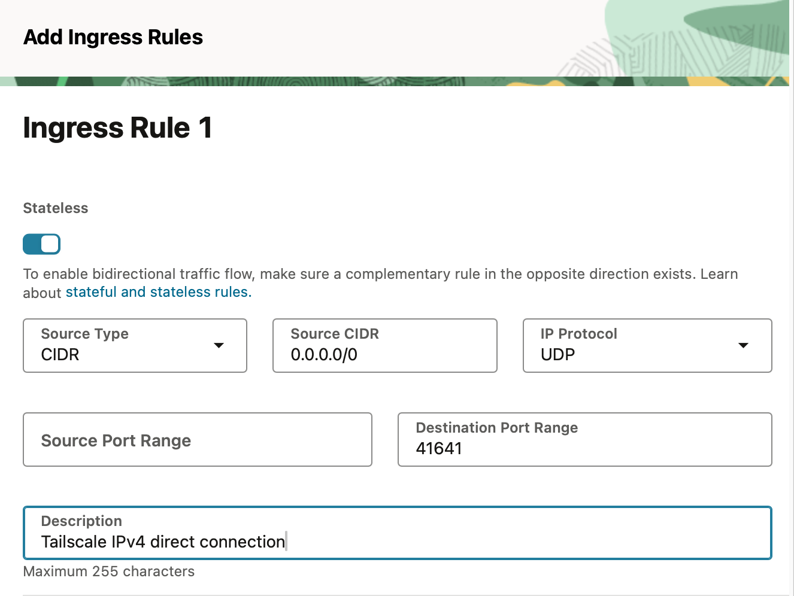
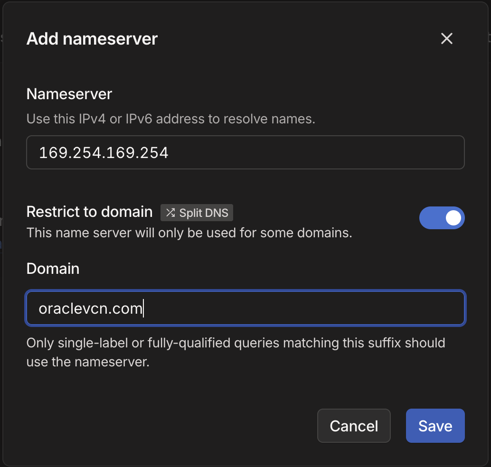

# Installa Proxmox VE 8 su Oracle OCI (free tier)

[_documento editato il 2025-05-06_]

Oracle nella piattaforma _Oracle Cloud Infrastructure_ (OCI) mette a dispisizione un ottimo _tier gratuito_
In questo _tier_ sono disponibili risorse per creare instanze di macchine virtuali nel piano che viene indicato come _always-free_.

In particolare si hanno a disposizione:

- due instanze AMD x86_64 con 1/8 OCPU (corrispondenti a 2 vCPU) e 1GB di RAM.
- una istanza ARM-based 4 core e 24 GB di RAM

Inoltre si hanno a disposizione 200GB di blocco dati da utilizzare come memoria di massa.
Siccome il minimo utilizzabile per ogni istanza è pari a 49GB, alla fine si consiglia di utilizzare:

- 100GB per la istanza ARM-Based
- 50GB per ogni istanza AMD

Fatta questa premessa è chiaro che se si intende utilizzare una istanza OCI per far girare un server Proxmox VE allora l'unica
possibilità è quella di utilizza l'istanza ARM-based che presenta una buona quantità di
memoria RAM, risorsa indispensabile per il sistema Proxmox VE.

Essendo questa una macchina con architettura ARM buona parte della configurazione sarà simile a quanto già rappresentato nel documento:
[Installa Proxmox 8 su Raspberry Pi 5](proxmoxonpi5.md).

La vera difficoltà è quella di riuscire ad installare l'immagine di
Proxmox VE sull'istanza OCI, inquanto è una immagine non prevista dal
sistema automatizzato messo a disposizione da Oracle.

> **Reference**
>
> Buona parte delle procedure di seguito elencate sono state descritte
> sul [Frank Ruan's Blog](https://frank-ruan.com) ed in particolare
> nell'articolo: [Installing Proxmox VE on OCI](https://frank-ruan.com/2023/03/18/installing-proxmox-ve-on-oci/)

## Debian su istanza VM.Standard.A1.Flex

Si da qui per scontato che sia stata creata una instanza selezionando l'architettura ARM-based e collegando un blocco dati
di 100GB.

Occorre segnarsi l'indirizzo IP pubblico dell'istanza ed avere accesso alla console di controllo.
Inoltre occorre avere l'accesso _ssh_ remoto, normalmente viene utilizzato una chiave pubblica fornita in fase di creazione dell'istanza.

Ora occorre assicurarsi di avere settato il firewall per permettere al traffico internet di raggiungere l'istanza.

Connettersi all'istanza tramite connessioe SSH ed scaricare l'immagine necessaria per installare il da rete Proxmox:

```shell
sudo -i
cd /boot/efi
wget https://boot.netboot.xyz/ipxe/netboot.xyz-arm64.efi
```

Una volta eseguito il download sconnettersi dalla macchina. Ora dovremo far ripartire la
macchina cercando di intercettare al boot in modo da utilizzare l'immagine appena scaricata.

Nella pagina di interfaccia di OCI assicurarsi di avere lanciato la Console collegata
all'istanza. Per fare questo, una volta selezionata l'istanza, scegliere la voce _Console connection_ presente nel menù laterale.

La qui utilizzare "Lauch Cloud Shell connection". Questo apre a fondo pagina una console (Cloud Shell) connessa all'istanza.

Seguire attendamente le seguenti operazioni:

1. dalla pagina detaggli operare sul comando _Reboot_ e scegliere l'opzione 'Force reboot the
instance by immediately powering off, then powering back on'

2. Fare attenzione a ciò che avviene nella console (Cloud Shell) e premere `ESC` quando inizia
il reboot per far apparire la configurazione del Bios.


3. Utilizzando le frecce per muoversi selezionare:
`Boot Maintenance Manager` -> `Boot From File` -> Scegli il file dall'hard disk `netboot.xyz-arm64.efi`

4. Se tutto è andato come da copione si presenta l'interfaccia iPXE seguente


5. Seleziona `Linux Network Installs` -> `Debian` -> `Debian 12.0 (bookworm)` -> `Text Based Install`

6. procedere con l'istallazione facendo attenzione nel momento in cui chiede il partizionamento:
scegliere 'Guided - use entire disk and set up LVM'


7. A seguire accettare tutte le impostazioni di default

8. Riavviare il sistema

## Configurazione di Debian

Una volta installato, il sistema ha la necessità di alcune configurazioni utili per essere facilmente utilizzato.

1. Connessione SSH con utente (non root) creato durante l'installazione utilizzando l'indirizzo pubblico della istanza.

2. installare 'sudo' e vari altri software utili

   ```shell
   su -
   Password: (inserire la password di root)
   apt update
   apt install sudo wget curl iftop vnstat neofetch vim nano net-tools
   exit
   ```

3. aggiungere l'utente standard ai 'sudoers'. Lavorando sempre come 'root' eseguire

   ```shell
   su -
   usermod -aG sudo [nome utente]
   groups [nomeutente]
   exit
   ```

   L'utente deve uscire e rientrare affinchè venga caricata l'appartenenza al gruppo 'sudo'

4. (Opzionale) abilitare sudo senza password

   ```shell
   sudo visudo
   ```

   Editare il file aperto, cercare la linea con `%sudo ...` e modificarla in

   ```text
   %sudo   ALL=(ALL:ALL) NOPASSWD:ALL
   ```

   Chiudere il file con `Ctrl+x`, `y`, `Invio`

5. (Opzionale) aggiungere chiave pubblica per connessione SSH senza necessita di inserimento password.

   Dal proprio computer eseguire il comando:

   ```shell
   ssh-copy-id -i .ssh/[chiave]] [user]@[ip-address]
   ```

   Viene chiesta la password e al termine dovrebbe indicare di aver copiato una chiave

## Configurazione della rete

Si andrà a configurare la rete con IP statico.

Segnarsi l'indirizzo IP della macchina virtuale letto tramite il comando `ip address`

Nel mio caso : `10.0.0.177`

### Impostazione IP statico

Editare il file `/etc/network/interfaces`

Il file si presenta così:

```text
# This file describes the network interfaces available on your system
# and how to activate them. For more information, see interfaces(5).

source /etc/network/interfaces.d/*

# The loopback network interface
auto lo
iface lo inet loopback

# The primary network interface
allow-hotplug enp0s3
iface enp0s3 inet dhcp
```

Occorre modificare la parte finale in :

```text
# The primary network interface
allow-hotplug enp0s3
# iface enp0s3 inet dhcp
# Define Static IP
iface enp0s3 inet static
   address 10.0.0.117
   netmask 255.255.0.0
   gateway 10.0.0.1
```

### Edit file /etc/hosts

Editare il file `/etc/hosts` che dovrebbe essere simile a:

```text
127.0.0.1       localhost
127.0.1.1      pve-oci.vcn01191127.oraclevcn.com       pve-oci

# The following lines are desirable for IPv6 capable hosts
::1     localhost ip6-localhost ip6-loopback
ff02::1 ip6-allnodes
ff02::2 ip6-allrouters
```

Modificarlo in (sostituire HOSTNAME con il proprio hostname, nel mio caso `pve-oci`):

```text
127.0.0.1    localhost.localdomain  localhost
PUBLIC_IP    HOSTNAME.proxmox.com   HOSTNAME

# The following lines are desirable for IPv6 capable hosts
::1     localhost ip6-localhost ip6-loopback
ff02::1 ip6-allnodes
ff02::2 ip6-allrouters
```

Riavviare l'istanza.

## Installare Proxmox VE su Debian bookworm

> **Reference**
>
> Si fa riferimento alla guida ufficiale del porting di Proxmox su architettura arm64
>
> [Install Proxmox VE on Debian bookworm](https://github.com/jiangcuo/Proxmox-Port/wiki/Install-Proxmox-VE-on-Debian-bookworm)

### Aggiungere il repository di Proxmox VE

Occorre eseguire i seguenti comandi come `root`, quindi invocare il comando `sudo su -`

Aggiungiamo mil repository

```shell
echo 'deb [arch=arm64] https://mirrors.apqa.cn/proxmox/debian/pve bookworm port'>/etc/apt/sources.list.d/pveport.list
```

Aggiungiamo la chive del repository

```shell
curl -L https://mirrors.apqa.cn/proxmox/debian/pveport.gpg -o /etc/apt/trusted.gpg.d/pveport.gpg 
```

Aggiorniamo il repository ed il sistema

```shell
apt update && apt full-upgrade
```

### Installiamo i pacchetti Proxmox VE

Aggiungiamo `ifupdown2`

```shell
apt install ifupdown2
```

Ora è il momento dei pacchetti Proxmox VE

```shell
apt install proxmox-ve postfix open-iscsi
```

Durante questa installazione vengono fatte alcune richieste. Scegliere 'Local only' alla richiesta "Postfix Configuration"



E Accettare il nome server proposto:



A termine installazione viene richiesto se mantenere le modifiche al file `/etc/apt/sources.list.d/pveport.list

```text
Configuration file '/etc/apt/sources.list.d/pveport.list'
 ==> File on system created by you or by a script.
 ==> File also in package provided by package maintainer.
   What would you like to do about it ?  Your options are:
    Y or I  : install the package maintainer's version
    N or O  : keep your currently-installed version
      D     : show the differences between the versions
      Z     : start a shell to examine the situation
 The default action is to keep your current version.
*** pveport.list (Y/I/N/O/D/Z) [default=N] ?
```

Scegliere l'opzione di default `N`

## Accesso alla console di controllo (porta 8006)

Ora il sistema è installato, occorre solo riuscire ad accedere alla console di gestione pubblicata sulla porta 8006.

Possiamo raggiungere questa porta in due modi:

- pubblicando la porta su internet (modo più semplice ma nmeno sicuro)
- utilizzare una connessione VPN come ad esempio Tailscale.

### Pubblicazione della porta

Controlla le regole del firewall su OCI

Su Oracle Cloud Infrastructure, devi configurare correttamente le Security Lists o i Network Security Groups (NSG).

1. Vai su _OCI Console_ -> _Networking_ -> _Virtual Cloud Network (VCN)_

2. Selezione la rete e dal nuovo menù scegli la voce _Security Lists_ poi seleziona la lista presente

3. Aggiungi la nuova regola _Add Ingress Rules_ con i seguenti parametri:
   - Source CIDR: Il tuo IP pubblico o 0.0.0.0/0 (se vuoi aprirlo a tutti)
   - Destination Port Range: 8006
   - Protocol: TCP
   - Stateless: No

   

Ora è possibile accedere alla console di Proxmox tramite l'indirizzo:

`https://IP_PUBBLICO:8006`

## Utilizzo di una VPN (Tailscale)

Potrebbe essere utile configurare la macchina su di una propria VPN in modo che sia facilemnte accessibile dalla propria rete interna.

Personalmente utilizzo [Tailscale](https://tailscale.com). Per eseguire l'installazione di Tailscale sulla macchina si esegue
lo script per l'installazione su piattaforma Linux; da console lanciare il comando:

```bash
curl -fsSL https://tailscale.com/install.sh | sh
```

Terminata l'installazione proseguire con la registrazione della macchina sulla propria VPN:

```bash
sudo tailscale up
```

e seguire il link fornito per terminare la registrazione.

> ATTENZIONE
>
> Una volta registrata la macchina si consiglia di disabilitare la scadenza della chiave di connessione
> agendo sul menu `...` e attivando la voce `Disable key expiry`

### Configurazione personalizzata per Oracle Cloud

Si consiglia di seguire le impostazioni consigliate da Tailscale per la gestione corretta su Cloud Oracle presenti [qui](https://tailscale.com/kb/1149/cloud-oracle)

#### 1. Autorizza porta UDP 41641

Agendo sulla pagina di configurazione di Oracle Cloud selezionere il tab [Network](https://cloud.oracle.com/networking/vcns) e selezionare
**Virtual Cloud Networks** e poi selezionare la rete VCN utilizzata dalla macchina virtuale



Selezionare il tab **Security** e poi selezionare la lista di sicurezza (probabilmente l'unica di _Default_)



Scegliere **secutity Rules**
A questo punto aggiungere una _Regola ingresso Stateless per 0.0.0.0/0 UDP porta 41641



#### 2. Pubblica tutta la sottorete VCN tramite Tailscale

Può essere utile permettere alla connessione Tailscale di avere accesso a tutta la sottorete delle proprie VM su Oracle.

Da console eseguire il seguente comando

```bash
sudo tailscale up --advertise-routes=10.0.0.0/16,169.254.169.254/32 --accept-dns=false
```

> NOTA
>
> Affinché la sottorete sia pubblicata effettivamente, occorre agire sulla
> "Admin Console" di Tailscale e selezionando il device autorizzare la sottorete.

#### 3. Aggiungere Oracle DNS alla tailnet

Nella console di amministrazione nella [sezione DNS di tailscale](https://login.tailscale.com/admin/dns)

Selezionare `Add nameserver`/`Custom...`

Configurare come da immagine seguente



## Accesso alla console e prima configurazione

Una volta che si accede alla console occorre eseguire alcune prime operazioni:

### Aggiunta del repository di Proxmox

1. Accedi tramite utente `root` creato durante l'installazione di Debian

2. Seleziona la voce `Repositories`.

3. Seleziona il comando `Add`

4. Dal popup scegli come Repository `No-Subscription`

## Creare un cluster Proxmox tra due nodi connessi tramite tailscale

> NOTA:
> Questa procedura presuppone l'uso di Proxmox 8.
>
> I due nodi in questione saranno qui indicati con `pve1` e `pve2`. Occorre accertarsi che comunque non abbiano lo stesso nome.

### 1. Imposta correttamente /etc/hosts su entrambi i nodi

In entrambi i nodi editare il file `/etc/hosts` aggiungendo le seguenti righe:

```text
100.x.y.z   pve1
100.a.b.c   pve2
```

Usare gli **IP Tailscale** reali al posto di 100.x.y.z e 100.a.b.c

### 2. Creare il cluster sul nodo principale (pve1)

```bash
pvecm create nome-cluster
```

Importante: A questo punto Proxmox userà la prima interfaccia di rete disponibile.
Per forzare l’uso di Tailscale, modificheremo i file di configurazione subito dopo.

### 3. Modificare la configurazione del cluster

Su `pve1`, editare il file `/etc/pve/corosync.conf` e modificare la sezione `interface`:

```text
nodelist{
   node{
      name: pve1
      nodeid: 1
      quorum_votes: 1
      ring0_addr: 100.x.y.z
  }
}
```

Inoltre occorre modificare la geestione del "quorum" per permettere l'uso di solo 2 nodi.

Modificare la sezione `totem` aggiungendo:

```text
two_node: 1
wait_for_all: 0
```

Poi riavviare il servizio `corosync`

```bash
systemctl restart corosync
```

### 4. Aggiungere il secondo nodo (pve2)

Sul nodo pve2 eseguire:

```bash
pvecm add pve1
```

Usare l'**hostname** di `pve1` per assicurarsi che il cluster venga contattato tramite
Tailscale e che la verifica dell'hostname sia accettata

Il risultato dovrebbe essere qualcosa come:

```text
root@pve2:~# pvecm add pve1
Please enter superuser (root) password for 'pve1': ********
Establishing API connection with host 'pve1'
The authenticity of host 'pve1' can't be established.
X509 SHA256 key fingerprint is 9A:6D:E9:9A:DA:49:26:57:2B:57:62:21:A0:53:34:E6:D2:DA:5B:2B:EF:7B:FA:24:8B:71:20:C9:28:B2:00:3C.
Are you sure you want to continue connecting (yes/no)? yes
Login succeeded.
check cluster join API version
No cluster network links passed explicitly, fallback to local node IP '100.x.y.z'
Request addition of this node
Join request OK, finishing setup locally
stopping pve-cluster service
backup old database to '/var/lib/pve-cluster/backup/config-1744145363.sql.gz'
waiting for quorum...OK
(re)generate node files
generate new node certificate
merge authorized SSH keys
generated new node certificate, restart pveproxy and pvedaemon services
successfully added node 'pve2' to cluster.
```

### 5. Verificare lo stato del cluster

Su qualsiasi nodo eseguire:

```bash
pvecm status
```
