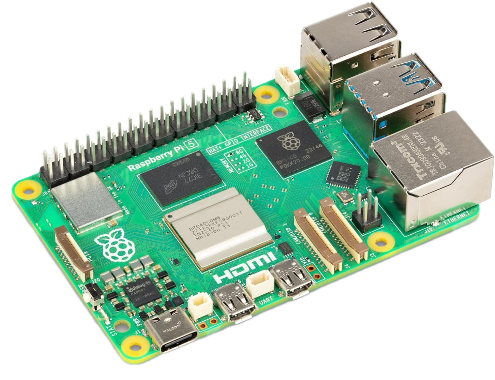
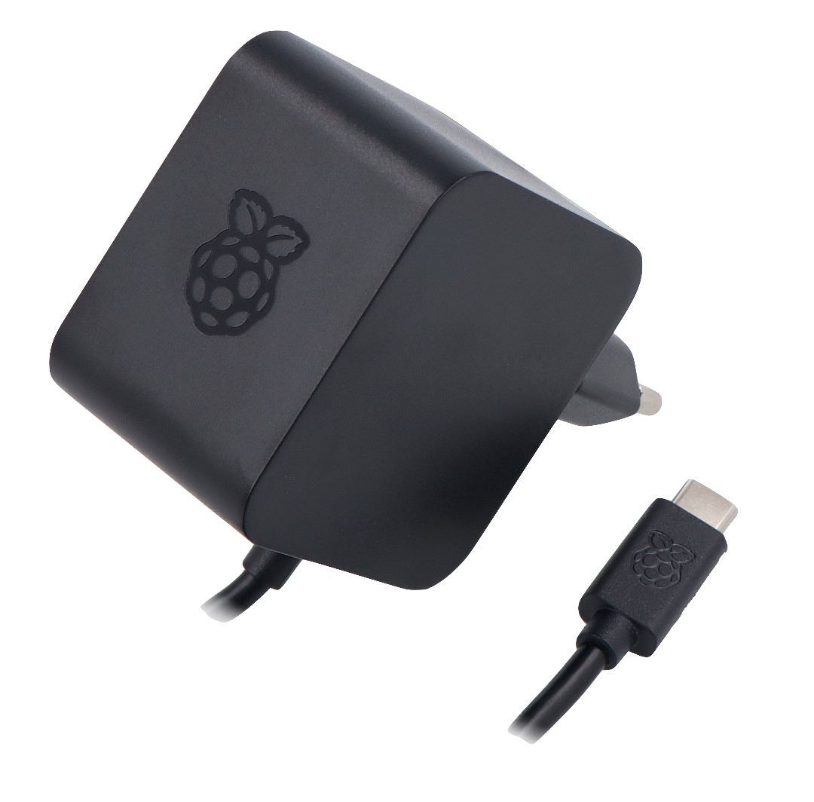
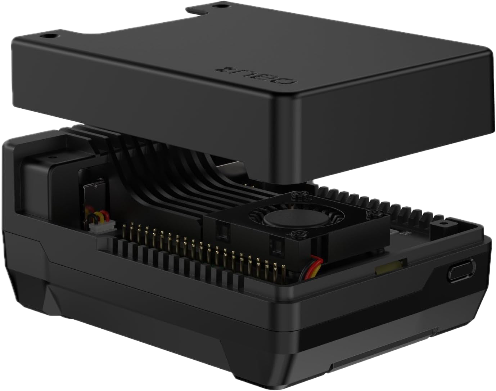
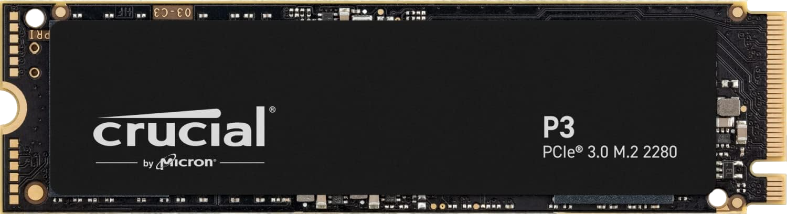
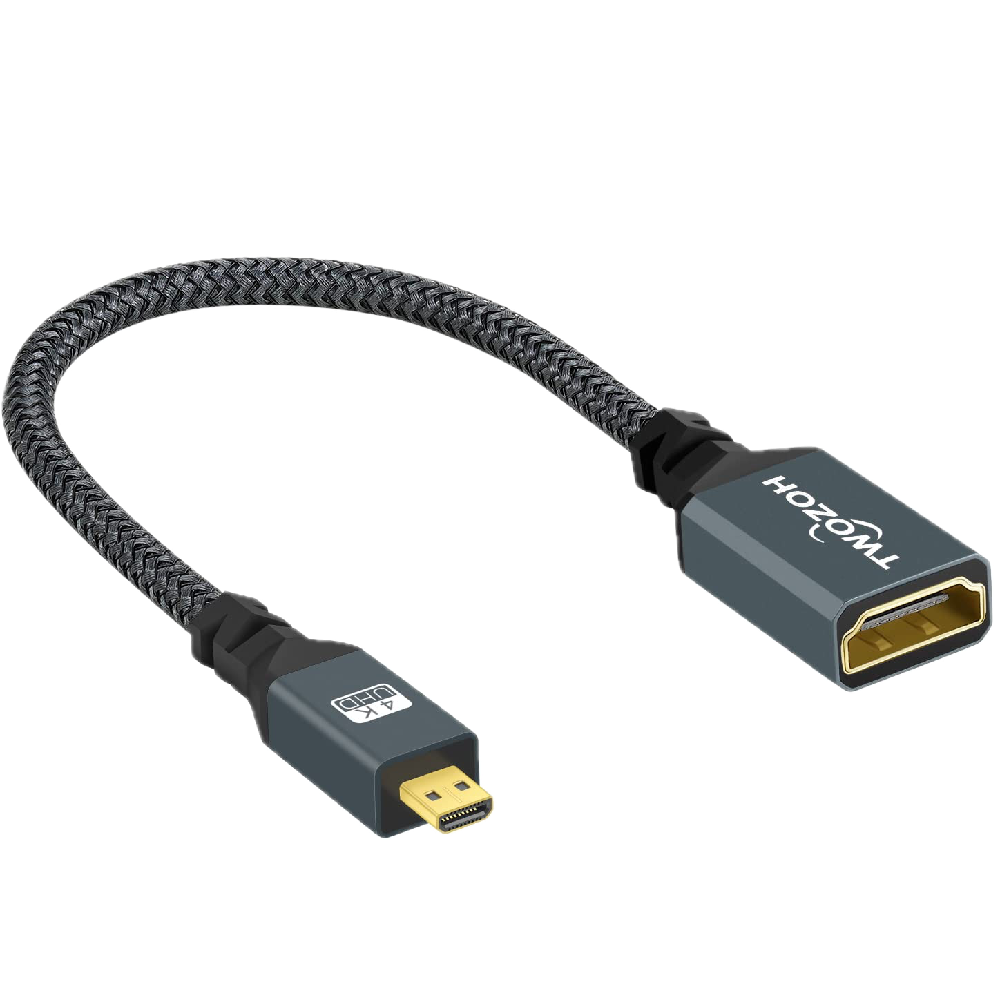

# Raspberry Pi 5 con SSD NVMe

Sono qui raccolte le operazione seguite per la preparazione del mio Homelab su base Raspberry Pi 5.

Materiali utilizzati:

| | | |
|---|--|---|
| { width="150" } | [Raspberry Pi 5 8GB Quad-Core ARMA76 (64 Bits - 2,4 GHz)](https://www.raspberrypi.com/products/raspberry-pi-5/)| acquista su [Amazon.it](https://www.amazon.it/dp/B0CK2FCG1K)|
| { width="150" } | [Alimentatore Raspberry Pi 5 USB-C da 27W](https://www.raspberrypi.com/products/27w-power-supply/) | acquista su [Amazon.it](https://www.amazon.it/dp/B0CN3MRV16)|
|{ width="150" } | [Argon NEO 5 M.2 NVME PCIE Case for Raspberry Pi 5](https://argon40.com/products/argon-neo-5-m-2-nvme-for-raspberry-pi-5) | acquista su [Amazon.it](https://www.amazon.it/dp/B0D3D64WZR)|
|{ width="150" } | [Crucial P3 500GB PCIe M.2 2280 SSD](https://it.crucial.com/products/ssd/crucial-p3-ssd) | acquista su [Amazon.it](https://www.amazon.it/dp/B0B25LQQPC)|
|{ width="150" } | Twozoh Adattatore Micro HDMI a HDMI | acquista su [Amazon.it](https://www.amazon.it/dp/B08PNW4W3V)|

Solo per uso temporaneo occorre anche avere a disposizione un scheda di memoria **microSD** della capacità di almeno 8Gb,
nonchè un **monitor HDMI** e un **mouse USB** e **tastiera USB**.

La preparazione dell'hardware non necessita di particolari istruzione, l'unico accorgimento è quello di evitare di chiudere
il case fino a quando l'installazione su memoria SSD non è stata terminata e correttamente verificata.

> **Nota**
>
> Il case non prevede l'accesso alla scheda microSD, quindi occorre terminare
> tutte le operazioni che la prevedano prima di estrarla e poi chiudere il case.

## Installazione del sistema operativo su memoria SSD

Se si ha a disposizione un adattatore per schede M.2 NVMe allora è
possibile effettuare l'installazione del sistema operativo direttamente sulla scheda di memoria.

Personalmnete non avendo a disposizione questo adattatore ho preferito effettuare l'operazione di
scrittura direttamente tramite la Raspberry Pi 5.

In linea di massima si consiglia di seguire le seguenti operazioni:

1. Scaricare l'applicativo [Raspberry Pi Imager](https://www.raspberrypi.com/software/) adatto al proprio Sistema Operativo.
2. Tramite _Raspberry Pi Imager_ programmare la scheda microSD con il SO **Raspberry Pi OS (64bit)**
3. Inserire la microSD nella Pi 5 e assicurarsi inoltre di avere inserito anche la memoria NVMe.
4. Avviare il Raspberry Pi 5 da microSD. Da applicazione Desktop assicurarsi di avere a
   disposizione l'applicativo _Raspberry Pi Imager_
5. Utilizzare _Raspberry Pi Imager_ da desktop su Pi 5 per programmare la memoria NVMe con il sistema operativo scelto.

   > Nota
   >
   > tramite _Raspberry Pi Imager_ è possibile predisporre alcune personalizzazioni
   > per il sistema, consiglio di:
   > - impostare username e password
   > - settare rete WiFi
   > - abilitare il servizio SSH per l'accesso remoto
   > - impostare timezone e layout tastiera

6. Accertarsi che al prossimo riavvio il sistema utilizzi NVMe come boot disk: da
   terminale lanciare `sudo raspi-config`, poi da menu `Advanced Options` -> `Boot Order`.
   Qui assicurarsi di utilizzare una opzione che permetta il boot da NVMe/USB in assenza
   di microSD (nel mio caso è la selezione di default).

L'installazione non è completata: al primo avvio parte una
procedura di installazione e configurazione che utilizzerà
tutto il disco,e effettuerà tutte le configurazioni iniziali.

Una volta terminata la procedura si presenta il terminale per poter effettuare login.

### Riduzione della partizione esistente

Se l'SSD utilizzato ha una dimensione sufficiente è consigliato ridurre la partizione principale
permettendo così di formattare una parte dell'SSD con filesystem più
opportuni, ad esempio per creare una partizione LVM utile per ottenere
una allocazione dinamica dei volumi.

Per effettuare la riduzione della partizione in modo indolore è consigliato effettuarlo con partizione non montata.
Questo è impossibile bootstrappando da SSD, quindi andremo a
riavviare il Raspberry utilizzando la scheda SD utilizzata in fase di
installazione.

Installare il pacchetto "Partition Manager KDE" (o in alternativa GParted)

Tramite l'interfaccia grafica e facile effettuare la riduzione della partizione.
In questo modo lasceremo dello spazio non partizionato che potremo utilizzare di seguito in base alle esigenze.

Nel mio caso ho scelto di mantenere 125GB (128000MB) come pertizione ext4.

Procedere salvando la nuova partizione e riavviando il sistema senza la scheda SD.
