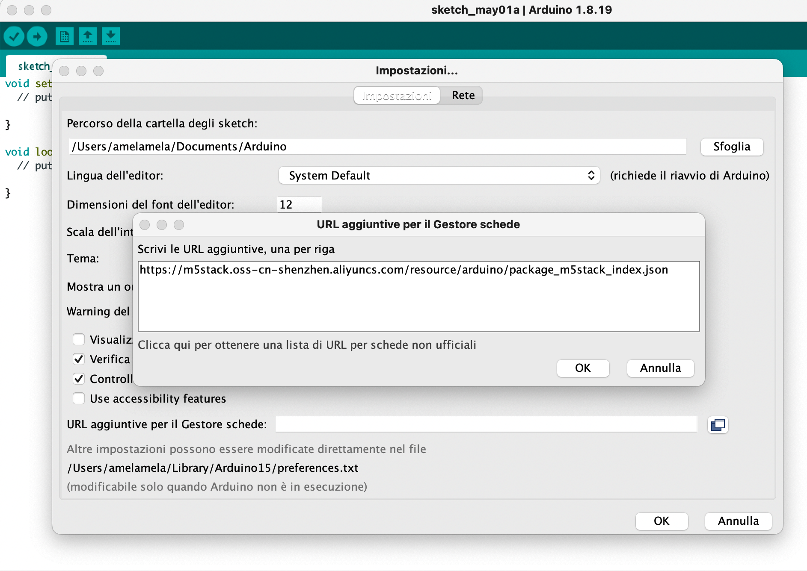
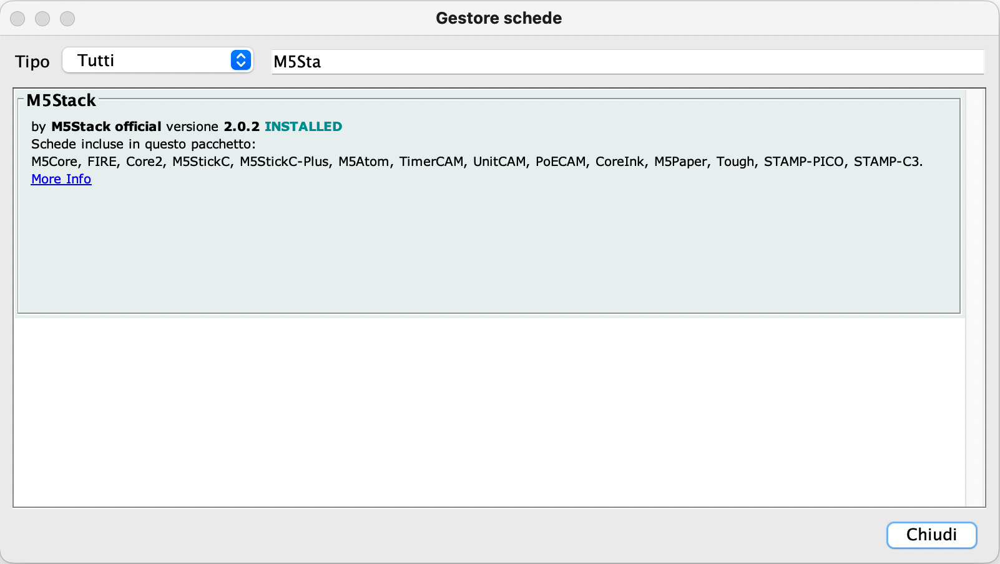

# M5Stack Core
last edited on 2022-05-01

M5Stack (<https://m5stack.com>) progetta e produce kit di sviluppo open-source, incluso hardware, piattaforma di programmazione e soluzioni IoT.

In particolare questo documento si riferisce all'utilizzo della piattaforma M5Stack Core, che consiste in una famiglia di controllori basati
su microcontrollori ESP32 e caratterizzata dalla costruzione modulare "stackabile".

Le istruzioni che seguono sono testate personalmente sul modello [M5Stack Core FIRE](https://docs.m5stack.com/en/core/fire).

## Arduino IDE environment (su MacBook Pro M1 Pro)

Ovviamente se riporto questi appunti significa che la guida ufficiale necessita di alcune personalizzazioni affinchè si riesca a far funzionare il tutto.

Partiamo dalla guida ufficiale: [Arduino IDE environment - M5Core](https://docs.m5stack.com/en/quick_start/m5core/arduino), e seguimo i seguenti passaggi:

1. Istallazione del driver USB, selezionando `CP210x_VCP_MacOS`, l'altro driver nel mio caso non è stato necessario

2. Scaricare l'IDE Arduino: pur volendo utilizzare la nuova versione 2.0 è necessario installare anche la versione precedente in quanto solo
   su questa sembra funzionare l'installazione dei dispositivi e delle librerie necessarie.
   Quindi scaricare sia la versione `Arduino IDE 1.8.x` che la versione `Arduino IDE 2.0 RC` dal [sito ufficiale](https://www.arduino.cc/en/software).

3. Installare entrambe le versioni di _Arduino IDE_, io personalmente le ho installate nella cartella `~/Applications` dell'utente e non nella cartella
   globale.

4. Eseguire la **versione 1.8.x** e, seguendo le istruzioni copiare tra gli _URL per la gestione di schede addizionali_:
   ```txt
   https://m5stack.oss-cn-shenzhen.aliyuncs.com/resource/arduino/package_m5stack_index.json
   ```
   

5. E' ora possibile installare le schede _M5Stack_ nella configurazione del _Gestore schede_
   

6. Installazione delle librerie
   > Attenzione
   >
   > Installando le librerie nella guida ufficiale si richiede di installare tutte le librerie dipendenti, ma purtroppo
   > buona parte di esse sembrano avere problemi di installazione, almeno sul mio _MacBook Pro M1 Pro_
   Da _Gestione librerie_ installare le seguenti librerie (versioni installate al momento della scrittura della presente guida):
   - M5Stack (0.4.0)
   - M5GFX (0.0.20)

7. Preparare sketch di test :
   ```c
   #include <M5Stack.h>

   /* After M5Core is started or reset
   the program in the setUp () function will be run, and this part will only be run once.
   After M5Core is started or reset, it will start to execute the program in the setup() function, and this part will only be executed once. */
   void setup(){
     M5.begin(); //Init M5Core. Initialize M5Core
     M5.Power.begin(); //Init Power module. Initialize the power module
                       /* Power chip connected to gpio21, gpio22, I2C device
                         Set battery charging voltage and current
                         If used battery, please call this function in your project */
     M5.Lcd.print("Hello World"); // Print text on the screen (string) Print text on the screen (string)
   }

   /* After the program in setup() runs, it runs the program in loop()
   The loop() function is an infinite loop in which the program runs repeatedly
   After the program in the setup() function is executed, the program in the loop() function will be executed
   The loop() function is an endless loop, in which the program will continue to run repeatedly */
   void loop() {

   }
   ```

8. Programmare il dispositivo, usando _Arduino IDE 2.0.0_:
   - collegare la scheda alla porta USB
   - selezionare la scheda : **M5Stack-FIRE**
   - selezionare la porta di comunicazione : **/dev/cu.usbserial-02161434** (o similare)
   - selezionare la voce di menù `Sketch/Carica`

   > **Errore di compilazione su Arduino IDE 1.8.x**
   >
   > In fase di compilazione la IDE cerca di utilizzare il comando `python` per eseguire la compilazione, ma purtroppo
   > questo comando non è più presente in MacOS, occorre utilizzare il comando `python3`.
   >
   > Una possibile soluzione è quella di creare un link di `python3` come `python`:
   >
   > ```sudo ln -s -f /usr/bin/python3 /usr/local/bin/python```
   >
   > e lanciare poi l'IDE da linea di comando:
   >
   > ```./Applications/Arduino.app/Contents/MacOS/Arduino```
   >
